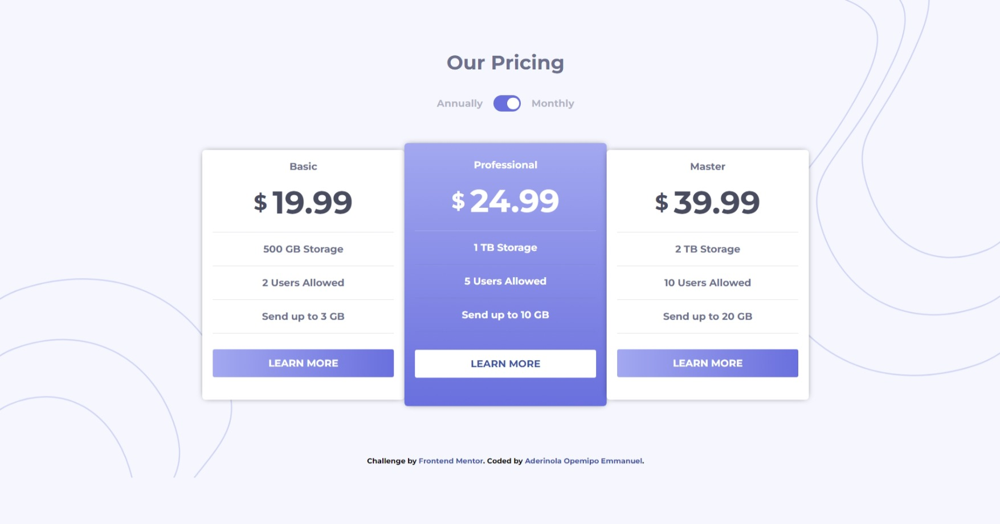

# Frontend Mentor - Pricing component with toggle solution

This is a solution to the [Pricing component with toggle challenge on Frontend Mentor](https://www.frontendmentor.io/challenges/pricing-component-with-toggle-8vPwRMIC). Frontend Mentor challenges help you improve your coding skills by building realistic projects. 

## Table of contents

- [Overview](#overview)
  - [The challenge](#the-challenge)
  - [Screenshot](#screenshot)
  - [Links](#links)
- [My process](#my-process)
  - [Built with](#built-with)
  - [What I learned](#what-i-learned)
  - [Continued development](#continued-development)
  - [Useful resources](#useful-resources)
- [Author](#author)


## Overview
It is a basic challenge to test your knowledge of HTML & CSS.
It consists of pricing components with a toggler to toggle the prices based on monthly or yearly preferences

### The challenge

Users should be able to:

- View the optimal layout for the component depending on their device's screen size
- Control the toggle with both their mouse/trackpad and their keyboard
- **Bonus**: Complete the challenge with just HTML and CSS

### Screenshot



### Links

- Solution URL: [Add solution URL here](https://your-solution-url.com)
- Live Site URL: [Add live site URL here](https://your-live-site-url.com)

## My process
  I started I looked up the original README.md file to get to know the objectives of the challenge and what styles or resources I would need to solve the challenge
  Then started by making a simple pen-paper sample of the page before proceeding to recreate the design.
  I started by writing out my html code working from top to bottom depending on how the elements are aligned and their requirements 
  Then i styled my contents based on the design provided
  I focused on the interactive and focus states of the links/buttons
  I got stuck while trying to make the toggle work perfectly so I searched for related resources which helped me solve the issue and add a new trick to my sleeve.
  Finally worked on the responsiveness of the design on mobile devices

### Built with

- Semantic HTML5 markup
- CSS custom properties
- Flexbox
- Desktop-first workflow
- [jQuery](https://jquery.com) - JS library

### What I learned

    The highlight of what I learnt is the price-toggle javascript function to toggle the display of the prices based between monthly and yearly preference.

```js
toggler.click(()=> {
    $(".toggle-button").toggleClass("toggle");

    for (let i = 0; i < monthlyPrice.length; i++) {
        for (let j = 0; j < yearlyPrice.length; j++) {
            
            if (monthlyPrice[i].style.display === "none") {
                monthlyPrice[i].style.display = "block";
                yearlyPrice[i].style.display = "none";
            }
            else {
                monthlyPrice[i].style.display = "none";
                yearlyPrice[i].style.display = "block";
            }
            
        }
        
    }
    
});
```

### Continued development
I want to learn more about the box-shadow concept as well as the CSS background-image and it's other attributes.
I would also like to update this solution after learning how to make a user toggle using their keyboard.

### Useful resources

- [Youtube](https://www.youtube.com) - This helped me for js sample code for the toggling of the price. I really liked this pattern and will use it going forward.

## Author
- Frontend Mentor - [@Oppy09](https://www.frontendmentor.io/Oppy09)
- Twitter - [@AderinolaOpemi5](https://www.twitter.com/AderinolaOpemi5)
